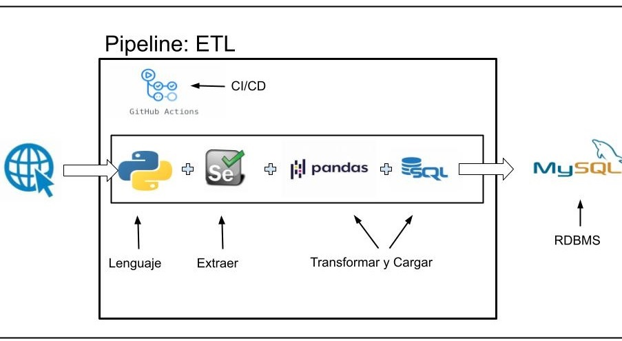

  

<h1 align="center">Proyecto: Grocery Price Data</h1>

Proyecto dedicado a la recopilación, procesamiento y análisis de precios de productos alimentarios obtenidos desde páginas web de supermercados en Argentina. Utilizando técnicas de web scraping y un proceso de ETL (Extract, Transform, Load), este proyecto automatiza la extracción de datos de precios de múltiples fuentes online. Posteriormente, aplica análisis detallados para identificar tendencias de precios, comparar variaciones entre diferentes supermercados y generar insights valiosos para consumidores. Grocery Price Data proporciona una herramienta poderosa para la toma de decisiones informadas en el mercado de alimentos, facilitando la monitorización continua de precios.

# Fase I

  

## Detalle de la Fase I:
- Se utiliza Python como lenguaje de programación.
  - Librerías utilizadas:
    - Selenium
    - webdriver-manager
    - Pandas
    - mysql-connector-python
    - time
- Se extraen los datos de las diferentes páginas web de los supermercados con la herramienta de Selenium.
  - Pagínas de supermercado:
    - [Carrefour](https://www.carrefour.com.ar/)
    - [Dia](https://diaonline.supermercadosdia.com.ar/)
    - [Disco](https://www.disco.com.ar/)

  - Datos de los productos a extraer:
    - Prodcutos : azúcar, arroz, aceite, leche, fideos, huevos, queso, pan, pollo, carne_picada y lentejas   
    - Nota: los productos seleccionados son de la misma marca para cada categoría de producto. Si en algún supermercado no se encuentra la misma marca, se seleccionará un producto de la misma calidad de otra marca.

- Se hace un preprocesamiento de los datos con pandas y se guardan en un archivo CSV.
    - Se crea un dataframe con la lista de links y xpath para acceder a los datos.

      
    
    - Se crea una función llamada `def extract_text(id, url, by_type, identifier):` que devuelve un dataframe.

       

    - Se hace un merge de los DataFrames en función de la columna 'id'.

        

    - Se limpian las columnas de caracteres no necesario y se cambian los tipo de datos.  
       
       

          

- Se cargan los datos en una base de datos (MySQL) con la herramienta de MySQL Connector/Python.
- Se hace un proceso de ETL automatizado usando GitHub Actions para el CI/CD.